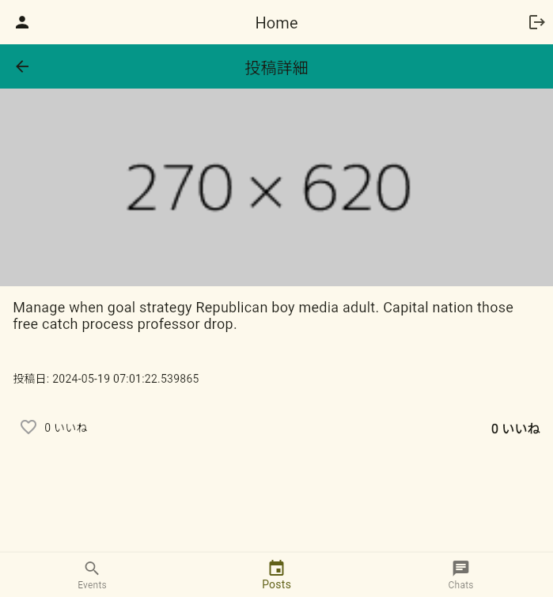
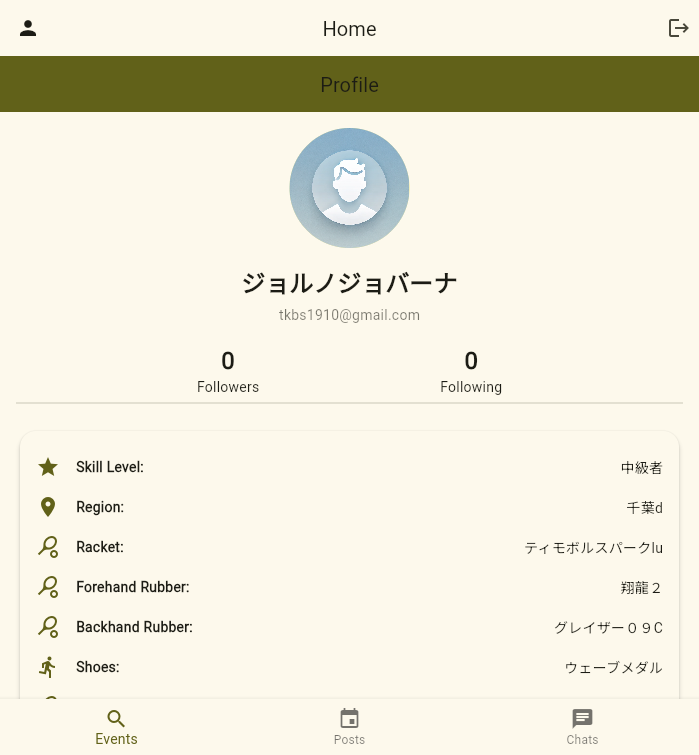
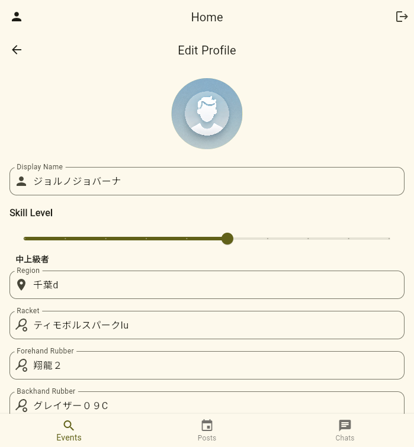

# [WIP]PingPongMix

**PingPongMix** は卓球プレイヤー同士のマッチングをサポートするアプリです。スキルレベルや地域、プレイスタイルに応じた相手探しが可能で、チャットやイベント参加機能も備えています。

## 🚀 機能一覧
- **ユーザー認証**: Firebase Authentication を使用したメール認証。
   - 
- **チャット**: Firestore によるリアルタイムチャット。
   - 
- **イベント管理**: 卓球イベントの作成・参加。
   - 
   - 
   - 
- **投稿機能**: ユーザーが画像付きの投稿を共有可能。
  - 
  - 
- **プロフィール編集**: ユーザー自分のプロフィールを編集できます
  - 
  - 
  

## 📱 画面構成
1. **スプラッシュ画面** - アプリ起動時のローディング処理
2. **ログイン/登録画面** - ユーザー認証を行う画面
3. **ホーム画面** - 各機能へのナビゲーション
4. **マッチング画面** - 対戦相手を検索
5. **チャット画面** - ユーザー間のメッセージのやり取り
6. **イベント一覧・詳細画面** - 卓球イベントの確認と参加
7. **プロフィール画面** - ユーザー情報の表示・編集
8. **マップ画面** - 卓球場やプレイヤーの位置を地図で確認

## 📂 プロジェクト構成
```
lib/
├── models/         # Firestore用のデータモデル
├── screens/        # 各画面のUI
├── viewmodels/     # Riverpodによる状態管理
├── services/       # Firebaseとのやり取りを行うサービス
├── widgets/        # 再利用可能なウィジェット
├── app.dart        # アプリのエントリーポイント
├── app_router.dart # 画面遷移の定義
├── main.dart       # Firebase初期化とアプリ起動
```

## 🔥 技術スタック
- **Flutter 3.22.0**
- **Firebase (Auth, Firestore, Cloud Messaging)**
- **Flutter Riverpod 2.5.1**
- **go_router 10.1.2** (画面遷移)
- **FlutterFire UI**

## 💻 環境構築
### 1. Firebase 設定
```bash
flutterfire configure --project=pong-mix
```

### 2. パッケージインストール
```bash
flutter pub get
```

### 3. アプリ実行
```bash
flutter run
```

## 📜 Firestore データ構造
```json
{
  "Users": {
    "userId": {
      "displayName": "John Doe",
      "email": "john@example.com",
      "region": "Tokyo"
    }
  },
  "Matches": {
    "matchId": {
      "playerOneId": "user123",
      "playerTwoId": "user456",
      "result": "Player One won"
    }
  }
}
```

## 📝 コーディング規約
- **クラス名**: PascalCase (`MyClass`)
- **メソッド名**: camelCase (`myMethod()`)
- **ファイル名**: snake_case (`my_file.dart`)
- **コード整形**: `flutter format .`

## 🎨 デザインテーマ
`appainter_theme.json` に定義されたデザイン設定を使用。

## 🛠️ 今後の開発予定
- **マップ機能**: 近くの卓球場やプレイヤーを表示。
- 試合結果登録機能の実装
- Eloレーティングによるランキング機能
- 団体戦のサポート
- ユーザー間マッチング: スキルレベル・地域に基づく対戦相手検索
   - 上記に伴う本人確認
- ライブ配信機能

## 📜 ライセンス
MIT License

