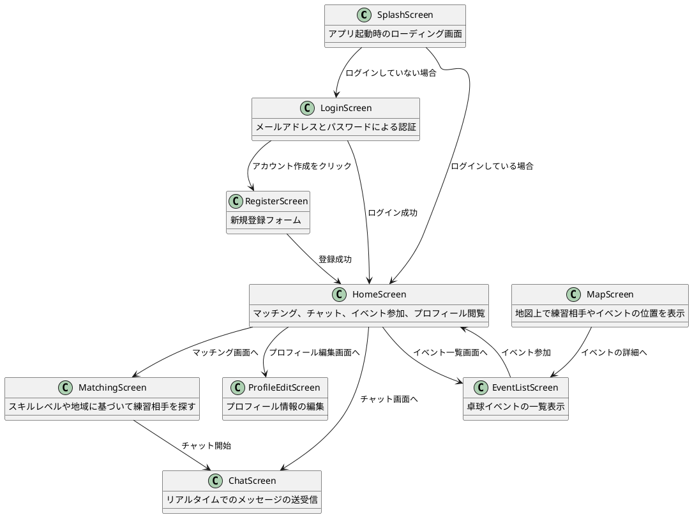

# 画面遷移図

## 1. スプラッシュ画面 (Splash Screen)
- **目的**: アプリ起動時のローディング画面。アプリの初期化と必要なデータのロードを行う。
- **遷移**:
  - ログインしている場合: ホーム画面へ自動的に遷移。
  - ログインしていない場合: ログイン画面へ遷移。

## 2. ログイン画面 (Login Screen)
- **目的**: ユーザーがアプリにログインするための画面。
- **機能**: メールアドレスとパスワードによる認証。
- **遷移**:
  - ログイン成功: ホーム画面へ遷移。
  - ログイン失敗: エラーメッセージを表示。
  - 「アカウントを作成」をクリック: ユーザー登録画面へ遷移。

## 3. ユーザー登録画面 (Register Screen)
- **目的**: 新規ユーザーがアカウントを作成するための画面。
- **機能**: 新規登録フォーム（メールアドレス、パスワード、必要なプロファイル情報入力）。
- **遷移**:
  - 登録成功: ホーム画面へ遷移。
  - 登録失敗: エラーメッセージを表示。

## 4. ホーム画面 (Home Screen)
- **目的**: ログイン後のメイン画面。各種機能へのナビゲーション提供。
- **機能**: マッチング、チャット、イベント参加、プロフィール閲覧など。
- **遷移**:
  - マッチング: マッチング画面へ遷移。
  - チャット: チャット画面へ遷移。
  - イベント参加: イベント一覧・詳細画面へ遷移。
  - プロフィール設定: プロフィール編集画面へ遷移。
  - ログアウト: ログイン画面へ戻る。

## 5. マッチング画面 (Matching Screen)
- **目的**: スキルレベルや地域に基づいて練習相手を探す画面。
- **機能**: ユーザーがフィルタリング条件を設定し、適合する他のプレイヤーをリスト表示。
- **遷移**:
  - プレイヤー選択: プレイヤーの詳細画面へ遷移。
  - チャット開始: 選択したプレイヤーとのチャット画面へ遷移。

## 6. プロフィール編集画面 (Profile Edit Screen)
- **目的**: ユーザーが自己のプロフィール情報（写真、スキルレベル、プレイスタイルなど）を編集する画面。
- **機能**: プロフィールの詳細を更新。
- **遷移**:
  - 変更保存: ホーム画面に戻る。

## 7. チャット画面 (Chat Screen)
- **目的**: マッチしたプレイヤーとのコミュニケーションを行う画面。
- **機能**: リアルタイムでのメッセージの送受信。
- **遷移**:
  - チャット終了: ホーム画面またはマッチング画面へ戻る。

## 8. イベント一覧・詳細画面 (Event List/Detail Screen)
- **目的**: 卓球イベントの一覧を表示し、詳細を確認する画面。
- **機能**: イベントの参加登録、イベント情報の確認。
- **遷移**:
  - イベント参加: イベント参加後、ホーム画面に通知を表示。

## 9. マップ画面 (Map Screen)
- **目的**: 地図上で練習相手やイベントの位置を表示し、地理的に適したマッチを提供する画面。
- **機能**:
  - 地図上に登録されたユーザーやイベントの位置をマーカーで表示。
  - ユーザーが地図上のマーカーを選択することで、そのプレイヤーの詳細情報やイベント詳細にアクセスできる。
  - 地域を絞り込み、特定の条件に合致するセッションやイベントのみを表示するフィルタリング機能。
- **遷移**:
  - プレイヤーまたはイベントの詳細: 選択したマーカーの詳細画面へ遷移。
  - フィルター適用後の結果: 地図上に再度反映される。

## PlantUML
